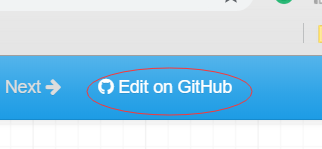

# MkDocs: 基于markdown快速搭建静态文档网站

[MkDocs](https://www.mkdocs.org/)可以快速的把markdown文件构建成静态网站

## **快速开始**

以下操作在centos 7系统中测试通过

#### **安装pip**
```bash
$ curl https://bootstrap.pypa.io/get-pip.py -o get-pip.py
$ python get-pip.py
$ pip --version
pip 18.1 from /usr/lib/python2.7/site-packages/pip (python 2.7)
```

#### **安装MkDocs**
```bash
$ pip install mkdocs
$ mkdocs --version
mkdocs, version 1.0.4 from /usr/lib/python2.7/site-packages/mkdocs (Python 2.7)
```

#### **创建文档项目**
```bash
$ mkdocs new my-project
$ cd my-project
$ tree
.
├── docs
│   └── index.md
└── mkdocs.yml

1 directory, 2 files
```
如上所示mkdocs会自动生成一些文件，`mkdocs.yml`是mkdos serve的配置文件，index.md是默认
的第一个页面。

#### **启动服务**
```bash
$ mkdocs serve
$ mkdocs serve --dev-addr 0.0.0.0:8080
INFO    -  Building documentation... 
INFO    -  Cleaning site directory 
[I 181106 19:47:51 server:292] Serving on http://0.0.0.0:8080
[I 181106 19:47:51 handlers:59] Start watching changes
[I 181106 19:47:51 handlers:61] Start detecting changes
```

#### **打开浏览器访问** `http://<server ip>:8080/`
`<server ip>`替换为我们运行mkdos serve的ip


## **个性化配置**

mkdocs给出了丰富的配置选择，通过修改配置我们个性化设置我们的mkdocs serve，
mkdocs的默认配置文件是`mkdocs.yml`，默认位于项目的顶级目录，我们也可以通过
`mkdocs serve -f <path/filemane>`指定别的配置文件。

#### **配置项目信息**

- **site_name**:

这个配置项用于配置项目的主标题，在配置文件中必须指定
```yaml
site_name: vangietech documents
```
在网页的左上角可以看到我们配置的标题


- **site_url**

设置站点的标准URL。这将向生成的HTML标头添加带有规范URL的链接标记
```yaml
site_url: http://www.vangie.com/docs/
```

- **site_description**

设置站点描述。这将向生成的HTML标头添加一个元标记。

- **site_author**

设置作者的名称。这将向生成的HTML标头添加一个元标记。

- **copyright**

根据主题设置文档中包含的版权信息。

- **repo_name**

设置我们项目存储的仓库的名称，需要和`edit_uri`配合使用，如果该配置项和`edit_uri`被设
置了，在生成的每一页网页的右上角都会提供一个跳转到仓库的的链接。
```
repo_name: GitHub
```

- **edit_uri**

和`repo_name`配合使用:

```yaml
edit_uri: https://github.com/vangietech/vangietech/tree/master/docs
```
效果如下:



点击`Edit on GitHub`，就会跳转到github相关的页面


#### **文档布局**

- **nav**

这个配置项用于设置站点的导航栏的格式和布局
```yaml
nav:
    - 目录: 'index.md'
    - 云计算:
        - Iaas: 'cloud/IaaS/README.md'
        - Pass: 'cloud/PaaS/README.md'
    - 工具:
        - MkDocs: 'tools/MkDocs/README.md'

```
上面的配置会产生如下效果:


#### **编译设置**

- **theme**

设置文档站点的主题和主题特定配置。取值可以是字符串或一组键/值对。
详细文档参考[主题样式设置](#主题样式设置)

- **docs_dir**

设置要编译的markdown文档的存放位置路径（相对于配置文件所在目录）
```yaml
docs_dir: docs
```

- **site_dir**

`mkdocs build`命令输出文件存放位置

- **extra_css**

额外css样式文件，供主题样式使用

- **extra_javascript**

额外js文件，供主题样式使用

- **extra_templates**

配置自定义主题使用的模板路径


## 主题样式设置

[参考链接](https://github.com/mkdocs/mkdocs/wiki/MkDocs-Themes)
